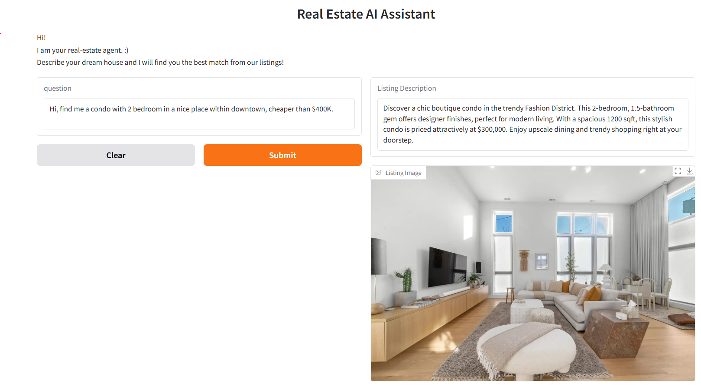
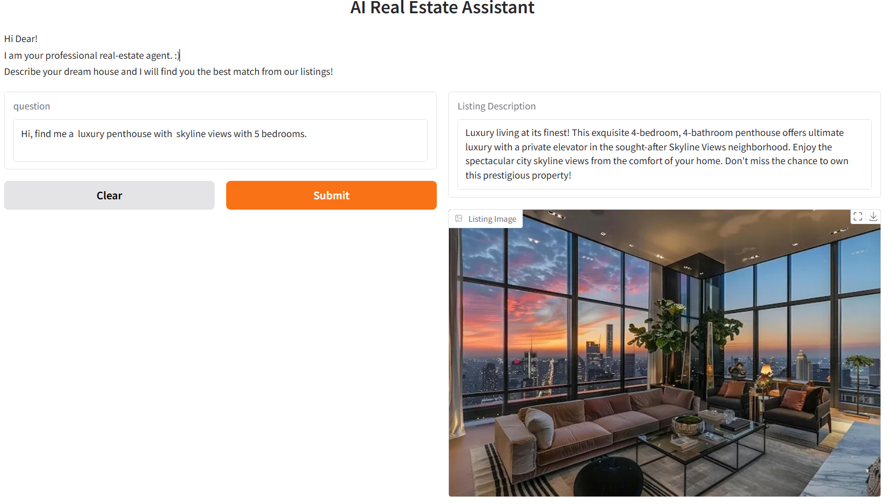

# Personalized Real Estate Agent

This project implements a personalized real estate assistant using advanced natural language processing (NLP) techniques, LangChain, GPT-3.5 language model. The assistant uses a semantic search system to recommend real estate listings that best match a user's preferences. It then generates a tailored marketing description for the most relevant listing and provides an image of the property.

## Key Features:

1. **Synthetic Data Generation**: 
   - **Generating Real Estate Listings with an LLM**: A synthetic dataset of real estate listings is created using an LLM (Large Language Model). This dataset is utilized for various tasks, such as training and testing.
   - **Generate Dataset Script**: The dataset generation script is available in `generate_dataset.ipynb`.

2. **Semantic Search**: 
   - **Creating a Vector Database**: The project generates embeddings of the real estate listings and stores them in a vector database using Chroma.
   - **Semantic Search of Listings**: Using buyer preferences (input questions), the system semantically searches through the dataset to find the most relevant listings.
   
3. **Personalized Listing Descriptions**: 
   - The real estate assistant generates unique and appealing descriptions for the most relevant listings based on the buyer's query and preferences.

4. **User Interface**: 
   - The assistant is integrated with a **Gradio** interface for an easy-to-use, interactive experience where users can input their preferences and view the most relevant listings and their descriptions.

## Folder Structure:
```
/RealEstateAgent
│
├── /dataset           
├── /app.ipynb    
├── /generate_dataset.ipynb
├── requirements.txt     
└── README.md            
```


## Requirements:
To run this project, you will need the following Python packages:

- **Gradio**: For building the interactive user interface.
- **Langchain**: For chaining together language models and document retrieval tasks.
- **OpenAI**: For using OpenAI's GPT models.
- **Chroma**: For creating a vector database for semantic search.
- **Pydantic**: For structured output parsing.
- **Requests**: For fetching images from URLs.
- **Pillow**: For image manipulation.


The `requirements.txt` file includes all the necessary packages.

## How to Run:
You can install the dependencies by running:

1. **Clone the repository**:
   ```
   cd real-estate-agent
   git clone https://github.com/amirhnazerii/Real-Estate-AI-Agent.git
   ```

## Install dependencies: 

Ensure that the required libraries are installed:
```
pip install -r requirements.txt
```

## Set Up Your OpenAI API Key:
Replace sk-xxxxxxx in the script with your OpenAI API key. You can sign up for an OpenAI account here.

## Run the Jupyter Notebook:
If you'd like to explore dataset generation, run the generate_dataset.ipynb notebook.
```
jupyter notebook generate_dataset.ipynb
```

## Start the Real Estate Assistant App:
Once the environment is set up, you can run the main Gradio interface by running the last cell of `app.ipynb`.
This will launch a web-based user interface where you can interact with the assistant.

## Usage:
Once the app is launched, you will be able to:

* Ask questions about real estate listings in natural language (e.g., "Show me houses with 3 bedrooms and a pool").
* View a tailored description of the most relevant listing based on your preferences.
* See an image of the property if available.

## Example interaction:






## Notes:
- The dataset (`RealEstateListingsDatasetv2.csv` and `RealEstateListingsDatasetv3.json`) used in the project is a synthetic dataset generated via LLM. You can modify or replace it with your own dataset.
- This project can be further expanded by incorporating more advanced features, such as dynamic filtering, recommendations based on user profile history, or integrating more sophisticated user interfaces.